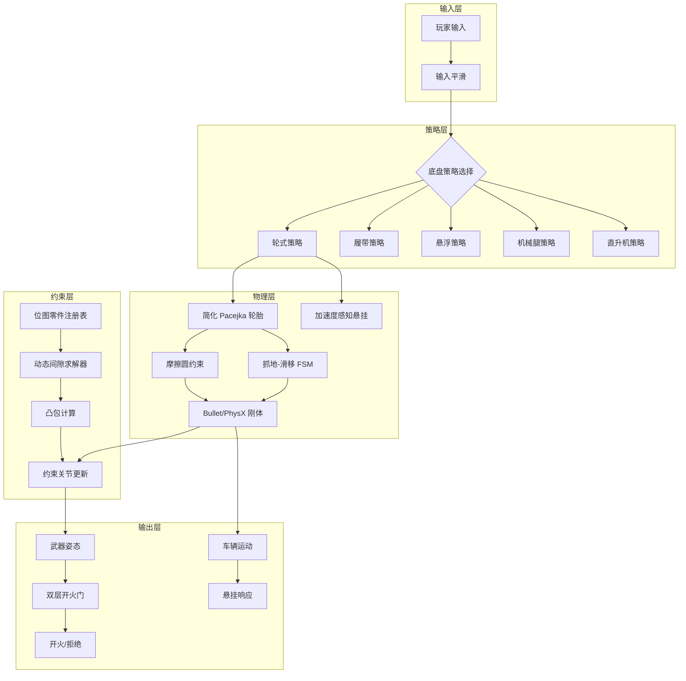

# 模块化载具游戏核心系统 — 通用设计模式注解

> **面向读者**: 游戏工程师、技术策划、技术美术
> **适用引擎**: Unity, Unreal Engine, Godot, 自定义 C++ 引擎
> **前置知识**: 基础线性代数、计算几何、刚体动力学
> **撰写依据**: 基于 Crossout（Dagor Engine + Bullet Physics）逆向分析提炼的通用化设计模式，已剥离引擎特定实现

---

## 符号约定

| 符号 | 含义 |
|------|------|
| $\vec{v}$ | 三维向量 |
| $\mathbf{R}$ | 旋转矩阵 / 四元数 |
| $\otimes$ | 四元数乘法 |
| $[a, b]$ | 闭区间 |
| $\|\vec{v}\|$ | 向量模长 |
| $\text{clamp}(x, a, b)$ | 将 $x$ 钳制在 $[a, b]$ |

---

## 第 1 章 · 动态间隙求解器 (Dynamic Clearance Solver)

### 1.1 设计意图

**问题**: 在一个"玩家可自由建造的模块化载具"中，武器/炮塔的旋转范围不是预设的固定值，而是被周围其他零件实时限制的。当这些阻挡零件被摧毁脱落后，约束应立即更新。

**解决方案**: 基于凸包计算的实时间隙检测 + 约束关节动态更新。

### 1.2 适用场景

- 模块化载具建造游戏（载具形态千变万化）
- 机甲/机器人建造游戏（关节被装甲板阻挡）
- 塔防游戏（防御塔被附近建筑遮挡射界）
- 任何"可破坏障碍物影响可动部件活动范围"的场景

### 1.3 结构

```
┌──────────────────────────────────────────────────┐
│                 ClearanceSolver                   │
├──────────────────────────────────────────────────┤
│  - partRegistry: BitmapPartRegistry              │
│  - hullCache: Map<MountPoint, ConvexHull>        │
│  - constraintMap: Map<MountPoint, JointHandle>   │
├──────────────────────────────────────────────────┤
│  + RecomputeClearance(mountPoint): AngleRange    │
│  + OnPartDestroyed(partId): void                 │
│  + OnPartAttached(partId): void                  │
│  - BuildObstaclePointCloud(mountPoint): Vec3[]   │
│  - ComputeFreeAngularSpace(points): AngleRange   │
│  - ApplyToConstraint(handle, range): void        │
└──────────────────────────────────────────────────┘
```

### 1.4 核心算法

```
算法 1.1: 计算武器在给定挂载点的自由旋转范围

输入:
  mountPoint     — 武器在载具坐标系中的挂载位置
  mountForward   — 武器的初始朝向（通常为挂载点的前向轴）
  weaponLength   — 武器（炮管）的有效长度
  weaponRadius   — 武器的碰撞半径

输出:
  yawRange:   [θ_min, θ_max]   — 偏航有效范围（弧度）
  pitchRange: [φ_min, φ_max]   — 俯仰有效范围

步骤:
  1. 收集障碍物点云:
     obstacles = []
     FOR EACH part IN partRegistry.activeParts:
       IF part.id == mountPoint.ownerPartId: CONTINUE     // 跳过武器自身
       IF partRegistry.isIgnored(part.id):  CONTINUE      // 跳过忽略列表中的零件
       // 将零件的碰撞几何体顶点变换到挂载点的局部坐标系
       localVertices = mountPoint.worldToLocal(part.collisionMesh.vertices)
       obstacles.extend(localVertices)

  2. 凸包计算（可选: 使用近似凸包以提升性能）:
     hull = ConvexHull(obstacles)      // 推荐: QuickHull 算法, O(n log n)

  3. 极角采样确定自由空间:
     将武器简化为从原点出发、长度为 weaponLength、半径为 weaponRadius 的圆柱体
     
     yawRange = SampleAngularSpace(
       axis = localUp,        // 偏航绕 Y 轴
       minAngle = -π,
       maxAngle = +π,
       hull = hull,
       weaponLength, weaponRadius
     )
     
     pitchRange = SampleAngularSpace(
       axis = localRight,     // 俯仰绕 X 轴
       minAngle = -π/2,       // 通常俯仰不超过 ±90°
       maxAngle = +π/2,
       hull = hull,
       weaponLength, weaponRadius
     )

  4. 舒适范围计算（可选）:
     goodYaw = Intersect(yawRange, [nominalYawMin, nominalYawMax])
     goodPitch = Intersect(pitchRange, [nominalPitchMin, nominalPitchMax])

  5. 返回 yawRange, pitchRange


算法 1.2: 极角采样 (SampleAngularSpace)

  function SampleAngularSpace(axis, minAngle, maxAngle, hull, length, radius):
    freeIntervals = []
    
    FOR angle = minAngle TO maxAngle STEP resolution:
      // 构建武器在此角度下的旋转四元数
      rotation = Quaternion.AngleAxis(angle, axis)
      
      // 构建武器在此角度下的简化碰撞体（圆柱/胶囊体）
      weaponCapsule = Capsule(
        origin = Vec3.zero,
        direction = rotation * mountForward,
        length = length,
        radius = radius
      )
      
      // 检测碰撞
      IF NOT Intersects(weaponCapsule, hull):
        将 angle 合并到 freeIntervals

    // 可选: 移除过小的间隙（如小于 5° 的缝隙，实际不可用）
    freeIntervals = MergeIntervals(freeIntervals, minGap = 5°)

    RETURN freeIntervals
```

### 1.5 实现要点

**性能优化**:
- **增量更新**: 零件脱落后，只对受影响的挂载点重新计算（使用 `participatedJams` 追踪哪些零件参与了对哪个武器的阻挡）
- **位图加速**: 使用 64 位或 128 位掩码实现 O(1) 的零件归属查询（见第 4 章）
- **凸包缓存**: 对相同的车体子结构缓存凸包，零件未变更时直接复用
- **多级 LOD**: 
  - 远距离武器 → 使用粗略 AABB 替代精确碰撞网格
  - 近距离武器 → 使用完整碰撞几何体

**数值鲁棒性**:
- 极角采样分辨率建议 1°~2°（约 180~360 次射线检测）
- 对于多管武器，将每个炮管独立检测后取交集
- `minGap` 参数防止角度缝隙导致的武器抖动

### 1.6 跨引擎映射

| 概念 | Unity | Unreal | Godot | Bullet Physics |
|------|-------|--------|-------|----------------|
| 凸包计算 | `GeometryUtility` (受限) / 自实现 | `FConvexHull` / Chaos | `Geometry.convex_hull` | `btConvexHullShape` |
| 碰撞检测 | `Physics.CapsuleCast` | `FCapsuleTrace` | `PhysicsShapeQuery` | `btCollisionWorld::convexSweepTest` |
| 约束关节 | `ConfigurableJoint` | `FConstraintInstance` | `Generic6DOFJoint` | `btGeneric6DofSpring2Constraint` |
| 位图查询 | `BitArray` / `ulong` | `TBitset` / `uint64` | `BitMap` | N/A |

---

## 第 2 章 · 抓地力-滑移状态机 (Grip-Skid FSM)

### 2.1 设计意图

**问题**: 在实时游戏中模拟轮胎的抓地力丧失与恢复，既要可信又要可控。完整的 Pacejka 魔术公式有 20+ 参数且计算昂贵，不适合在每帧对多个轮胎调用。

**解决方案**: 简化 Pacejka 公式 + 摩擦圆约束 + 迟滞状态机（抓地→滑移与滑移→抓地使用不同参数，避免振荡）。

### 2.2 数学基础

#### 2.2.1 完整 Pacejka 公式（参考）

$$F = D \cdot \sin\big(C \cdot \arctan(B \cdot x - E \cdot (B \cdot x - \arctan(B \cdot x)))\big) + S_v$$

其中 $x = \alpha + S_h$（$\alpha$ 为侧偏角），$B$ 为刚度因子，$C$ 为形状因子，$D$ 为峰值因子，$E$ 为曲率因子，$S_h$ 和 $S_v$ 为水平和垂直偏移。

#### 2.2.2 简化 Pacejka（游戏级）

游戏级简化方案将参数缩减为 2~3 个可调参数：

$$F_{lateral}(\alpha) = \mu \cdot F_z \cdot \sin\big(K \cdot \arctan(\alpha)\big)$$

其中：
- $\mu$ — 峰值摩擦系数（由路面材质决定）
- $F_z$ — 轮胎法向力（由悬挂和载重决定）
- $K$ — 形状因子（控制曲线陡峭度，2~5 为常用范围）
- $\alpha$ — 侧偏角（弧度）

```python
def simplified_pacejka(slip_angle_rad: float, 
                        friction_coeff: float, 
                        normal_force: float,
                        shape_factor: float = 3.0) -> float:
    """
    游戏级简化 Pacejka 轮胎模型
    
    Args:
        slip_angle_rad: 侧偏角 (弧度), 或纵向滑移率
        friction_coeff: 峰值摩擦系数 μ (0.3~1.2, 取决于路面)
        normal_force: 法向力 Fz (牛顿)
        shape_factor: 形状因子 K (2.0=渐进, 5.0=陡峭)
    
    Returns:
        侧向力 (牛顿)
    """
    peak_force = friction_coeff * normal_force
    return peak_force * math.sin(shape_factor * math.atan(slip_angle_rad))
```

### 2.3 摩擦圆约束

摩擦圆约束确保纵横向合力不超过物理极限：

$$\sqrt{F_x^2 + F_y^2} \leq \mu \cdot F_z$$

```python
def apply_friction_circle(fx: float, fy: float, 
                          friction_coeff: float, 
                          normal_force: float) -> tuple[float, float]:
    """
    对轮胎的纵向力和侧向力施加摩擦圆约束
    
    如果合力超出摩擦圆，等比例缩放两个方向的分量。
    """
    max_force = friction_coeff * normal_force
    resultant = math.sqrt(fx * fx + fy * fy)
    
    if resultant > max_force and resultant > 1e-6:
        scale = max_force / resultant
        return fx * scale, fy * scale
    return fx, fy
```

### 2.4 迟滞状态机

解决"抓地-滑移"临界区的振荡问题：进入滑移和恢复抓地使用不同的摩擦系数。

```
状态定义:
  GRIP  — 正常抓地状态（高 μ）
  SKID  — 滑移状态（低 μ）

转移条件:
  GRIP → SKID:  |slip_angle| > grip_to_skid_threshold
                OR |slip_ratio| > grip_to_skid_threshold
  
  SKID → GRIP:  |slip_angle| < skid_to_grip_threshold
                AND |slip_ratio| < skid_to_grip_threshold
                AND 持续时间 > recovery_delay

关键: grip_to_skid_threshold > skid_to_grip_threshold（制造迟滞）
```

```python
class TireFrictionFSM:
    """轮胎摩擦状态机 — 带迟滞的抓地-滑移转换"""
    
    def __init__(self):
        self.state = "GRIP"
        self.skid_timer = 0.0
        
        # 进入滑移的阈值（较高 — 不容易触发）
        self.grip_to_skid_angle = math.radians(15.0)    # 15° 侧偏角
        self.grip_to_skid_ratio = 0.30                   # 30% 纵向滑移率
        
        # 恢复抓地的阈值（较低 — 需要更稳定才能恢复）
        self.skid_to_grip_angle = math.radians(8.0)     # 8° 侧偏角
        self.skid_to_grip_ratio = 0.15                   # 15% 纵向滑移率
        self.recovery_delay = 0.15                       # 0.15 秒稳定后恢复
        
        # 滑移时的摩擦系数（通常是抓地时的 60~80%）
        self.skid_friction_mul = 0.7
        
    def update(self, slip_angle: float, slip_ratio: float, 
               base_friction: float, dt: float) -> float:
        """返回当前状态下的有效摩擦系数"""
        
        abs_angle = abs(slip_angle)
        abs_ratio = abs(slip_ratio)
        
        if self.state == "GRIP":
            if abs_angle > self.grip_to_skid_angle or abs_ratio > self.grip_to_skid_ratio:
                self.state = "SKID"
                self.skid_timer = 0.0
                return base_friction * self.skid_friction_mul
            return base_friction
        else:  # SKID
            if abs_angle < self.skid_to_grip_angle and abs_ratio < self.skid_to_grip_ratio:
                self.skid_timer += dt
                if self.skid_timer >= self.recovery_delay:
                    self.state = "GRIP"
                    return base_friction
            else:
                self.skid_timer = 0.0
            return base_friction * self.skid_friction_mul
```

### 2.5 完整轮胎更新循环

```python
class SimplifiedTireModel:
    """单个轮胎的完整简化模型"""
    
    def __init__(self):
        self.fsm = TireFrictionFSM()
        self.shape_factor = 3.0       # Pacejka 形状因子
        self.rolling_resistance = 0.015  # 滚动阻力系数
        
    def compute_forces(self, 
                       wheel_velocity: Vec3,        # 轮胎接地点的世界速度
                       wheel_forward: Vec3,         # 轮胎前向单位向量
                       wheel_right: Vec3,           # 轮胎右向单位向量
                       normal_force: float,         # 法向力 (N)
                       surface_friction: float,     # 路面摩擦系数
                       drive_torque: float,         # 驱动力矩 (Nm)
                       brake_torque: float,         # 制动力矩 (Nm)
                       wheel_radius: float,         # 轮胎半径 (m)
                       dt: float) -> tuple[Vec3, float, float]:
        """
        返回: (世界坐标系下的总力, 纵向滑移率, 侧偏角)
        """
        
        # 1. 计算轮胎坐标系下的速度分量
        v_forward = dot(wheel_velocity, wheel_forward)
        v_side = dot(wheel_velocity, wheel_right)
        
        # 2. 计算纵向滑移率 (slip ratio)
        #    slip_ratio > 0: 驱动打滑; < 0: 制动打滑
        abs_v = abs(v_forward)
        if abs_v < 0.1:  # 极低速时避免除零
            slip_ratio = 0.0
        else:
            slip_ratio = (drive_torque / wheel_radius - v_forward) / abs_v
        
        # 3. 计算侧偏角 (slip angle)
        if abs_v < 0.1:
            slip_angle = 0.0
        else:
            slip_angle = math.atan2(v_side, abs_v)
        
        # 4. 获取当前有效摩擦系数（带迟滞）
        effective_mu = self.fsm.update(
            slip_angle, slip_ratio, surface_friction, dt
        )
        
        # 5. 简化 Pacejka 计算侧向力
        fy = simplified_pacejka(slip_angle, effective_mu, 
                                 normal_force, self.shape_factor)
        
        # 6. 纵向力：驱动力 - 制动力 - 滚动阻力
        fx_drive = drive_torque / wheel_radius
        fx_brake = brake_torque / wheel_radius
        fx_rolling = self.rolling_resistance * normal_force * sign(v_forward)
        fx = clamp(fx_drive, -effective_mu * normal_force, 
                    effective_mu * normal_force)  # 限制在摩擦圆内
        fx -= fx_brake + fx_rolling
        
        # 7. 摩擦圆约束
        fx, fy = apply_friction_circle(fx, fy, effective_mu, normal_force)
        
        # 8. 变换回世界坐标
        world_force = wheel_forward * fx + wheel_right * fy
        
        return world_force, slip_ratio, slip_angle
```

### 2.6 参数调校指南

| 参数 | 范围 | 效果 |
|------|------|------|
| `shape_factor` (K) | 1.5 ~ 5.0 | 越小越渐进（民用胎），越大越陡峭（赛车胎） |
| `rolling_resistance` | 0.01 ~ 0.03 | 影响极速和油耗感 |
| `skid_friction_mul` | 0.5 ~ 0.85 | 越小漂移越明显 |
| `grip_to_skid_angle` | 8° ~ 20° | 越小越容易触发滑移 |
| `skid_to_grip_angle` | 5° ~ 15° | 必须小于 `grip_to_skid_angle` |
| `recovery_delay` | 0.05 ~ 0.3s | 模拟轮胎重新建立抓地力的时间 |
| `surface_friction` | 0.2 (冰) ~ 1.2 (沥青) | 由物理材质系统提供 |

### 2.7 跨引擎映射

| 概念 | Unity | Unreal | Godot |
|------|-------|--------|-------|
| 轮胎模型 | `WheelCollider` (内置) / 自实现 | `ChaosVehicleWheel` / `SimpleWheeledVehicle` | `VehicleWheel3D` / 自实现 |
| 物理材质摩擦 | `PhysicMaterial` | `PhysicalMaterial` | `PhysicsMaterial` |
| 悬挂 | `WheelCollider.suspensionDistance` | `ChaosVehicleWheel.Suspension` | `VehicleWheel3D.suspension_travel` |

---

## 第 3 章 · 多底盘策略模式 (Multi-Chassis Strategy)

### 3.1 设计意图

**问题**: 一款游戏需要支持多种完全不同的移动方式（轮式、履带、悬浮、步行、飞行），它们共享输入接口但底层物理截然不同，同时未来可能扩展新类型。

**解决方案**: 策略模式 (Strategy Pattern) + 统一的 `IMovementStrategy` 接口。

### 3.2 类结构

```
┌──────────────────────────────────┐
│        VehicleController         │  ← 玩家输入接收
│  - input: VehicleInput           │
│  - strategy: IMovementStrategy   │  ← 可替换的策略对象
│  - speed: float                  │
│  - angularVelocity: float        │
├──────────────────────────────────┤
│  + SetStrategy(IMovementStrategy)│
│  + Update(dt)                    │
└──────────┬───────────────────────┘
           │ 依赖
           ▼
┌──────────────────────────────────┐
│    «interface» IMovementStrategy │
├──────────────────────────────────┤
│  + ProcessInput(input): void     │
│  + UpdatePhysics(dt): void       │
│  + GetMaxSpeed(): float          │
│  + GetCurrentTraction(): float   │
│  + NeedsSuspension(): bool       │
│  + GetSoundProfile(): SoundDef   │
│  + GetEffectProfile(): EffectDef │
└──────────┬───────────────────────┘
           │ 实现
     ┌─────┼─────┬──────────┬──────────┐
     ▼     ▼     ▼          ▼          ▼
┌────────┐┌────────┐┌────────┐┌────────┐┌────────┐
│ Wheel  ││ Track  ││ Hover  ││ Leg    ││Heli-   │
│Strategy││Strategy││Strategy││Strategy││copter  │
│        ││        ││        ││        ││Strategy│
└────────┘└────────┘└────────┘└────────┘└────────┘
```

### 3.3 接口定义（C#-风格伪代码）

```csharp
/// <summary>
/// 移动策略统一接口 — 所有底盘类型必须实现
/// </summary>
public interface IMovementStrategy
{
    /// <summary>处理玩家原始输入，转换为底盘特定的控制信号</summary>
    void ProcessInput(VehicleInput input, float dt);
    
    /// <summary>每物理帧调用，执行底盘特定的物理更新</summary>
    void UpdatePhysics(RigidBody vehicleBody, float dt);
    
    /// <summary>当前配置下的理论最大速度 (m/s)</summary>
    float GetMaxSpeed();
    
    /// <summary>当前有效牵引力比率 (0.0~1.0)，用于 UI 显示</summary>
    float GetCurrentTraction();
    
    /// <summary>该底盘是否需要悬挂系统</summary>
    bool NeedsSuspension();
    
    /// <summary>返回该底盘的音效配置</summary>
    SoundProfile GetSoundProfile();
    
    /// <summary>返回该底盘的粒子特效配置</summary>
    EffectProfile GetEffectProfile();
}

/// <summary>跨底盘类型的统一输入结构</summary>
public struct VehicleInput
{
    public float throttle;      // 油门 [-1 倒车, 0 空档, +1 前进]
    public float steer;         // 转向 [-1 左, 0 直行, +1 右]
    public float strafe;        // 横向平移 [-1 左, +1 右]（悬浮/腿式专用）
    public bool handbrake;      // 手刹
    public bool boost;          // 加速/冲刺
    public bool jump;           // 跳跃（腿式专用）
    public float pitchInput;    // 俯仰控制（直升机专用）
    public float rollInput;     // 横滚控制（直升机专用）
}
```

### 3.4 各策略的核心物理模型

#### 3.4.1 轮式策略

```csharp
public class WheelStrategy : IMovementStrategy
{
    private SimplifiedTireModel[] tires;  // 见第 2 章
    private SuspensionPoint[] suspensions;
    
    public void UpdatePhysics(RigidBody body, float dt)
    {
        foreach (var tire in tires)
        {
            // 1. 悬挂计算 → 得到法向力 Fz
            float suspensionForce = ComputeSuspension(tire, body, dt);
            
            // 2. 轮胎模型 → 得到世界力
            var (worldForce, slipRatio, slipAngle) = tire.ComputeForces(
                wheelVelocity: GetWheelVelocity(body, tire),
                wheelForward: tire.forward,
                wheelRight: tire.right,
                normalForce: suspensionForce,
                surfaceFriction: GetSurfaceFriction(tire),
                driveTorque: input.throttle * enginePower / tires.Length,
                brakeTorque: input.handbrake ? maxBrakeTorque : 0,
                wheelRadius: tire.radius,
                dt: dt
            );
            
            // 3. 在接地点施加力
            body.AddForceAtPosition(worldForce, tire.contactPoint);
        }
    }
}
```

#### 3.4.2 履带策略

```csharp
public class TrackStrategy : IMovementStrategy
{
    public void UpdatePhysics(RigidBody body, float dt)
    {
        // 履带使用滑移转向 (Skid Steering)
        float leftSpeed = input.throttle + input.steer * steerFactor;
        float rightSpeed = input.throttle - input.steer * steerFactor;
        
        // 分别控制左右履带速度
        ApplyTrackForce(body, leftTrack, leftSpeed, dt);
        ApplyTrackForce(body, rightTrack, rightSpeed, dt);
        
        // 履带侧向摩擦极高 — 使用简化 Pacejka 防止侧滑
        // Physics.Track.SimplifiedPacejkaSideFriction
    }
    
    private void ApplyTrackForce(RigidBody body, TrackSide track, 
                                  float targetSpeed, float dt)
    {
        // 计算当前履带接地点的实际速度
        float currentSpeed = GetTrackGroundSpeed(body, track);
        float speedError = targetSpeed - currentSpeed;
        
        // 摩擦力驱动：履带与地面之间的最大静摩擦力限制
        float maxForce = surfaceFriction * body.mass * 0.5f * GRAVITY;
        float driveForce = clamp(speedError * trackStiffness, -maxForce, maxForce);
        
        body.AddForceAtPosition(track.forward * driveForce, track.centerPoint);
    }
}
```

#### 3.4.3 悬浮策略

```csharp
public class HoverStrategy : IMovementStrategy
{
    public void UpdatePhysics(RigidBody body, float dt)
    {
        foreach (var thruster in hoverThrusters)
        {
            // 1. 高度控制 — PID 控制器
            float heightError = targetHeight - GetGroundDistance(thruster);
            float velocityError = -body.GetPointVelocity(thruster.position).y;
            float hoverForce = Kp * heightError + Kd * velocityError;
            hoverForce = max(0, hoverForce);  // 只推不拉
            
            // 2. 水平稳定性 — 倾斜角 PID
            float tiltError = Vector3.Angle(body.up, Vector3.up);
            Vector3 correctionTorque = -Ktilt * tiltError * body.angularVelocity.normalized;
            
            // 3. 水平推力
            Vector3 thrust = thruster.forward * input.throttle * maxThrust 
                           + thruster.right * input.strafe * maxThrust;
            
            body.AddForceAtPosition(
                thrust + Vector3.up * hoverForce, 
                thruster.position
            );
            body.AddTorque(correctionTorque);
        }
        
        // 悬浮特有的旋转阻尼以模拟"漂浮感"
        body.angularDrag = hoverAngularDrag;
    }
}
```

#### 3.4.4 机械腿策略

```csharp
public class LegStrategy : IMovementStrategy
{
    public void UpdatePhysics(RigidBody body, float dt)
    {
        // 腿部使用步态控制 — 每条腿独立管理一个步态周期
        foreach (var leg in legs)
        {
            leg.UpdateGait(input, body.velocity, dt);
            
            if (leg.IsInStancePhase())
            {
                // 支撑相 — 腿与地面接触，施加力
                Vector3 contactForce = ComputeLegForce(leg, body, dt);
                body.AddForceAtPosition(contactForce, leg.footPosition);
            }
            // 摆动相 — 腿在空中移动，不施加力
        }
        
        // 跳跃逻辑
        if (input.jump && AllLegsGrounded())
        {
            foreach (var leg in legs)
                leg.TriggerJump(jumpImpulse);
        }
    }
}
```

### 3.5 跨引擎映射

| 概念 | Unity | Unreal | Godot |
|------|-------|--------|-------|
| 策略模式 | 直接 C# 接口+类 | C++ 接口/UObject 多态 | GDScript/C# 接口 |
| 刚体 API | `Rigidbody.AddForceAtPosition` | `UPrimitiveComponent::AddForceAtPosition` | `RigidBody3D.apply_force` |
| PID 控制 | 自实现 | 自实现 / `FPIDController` | 自实现 |

---

## 第 4 章 · 位图零件注册表 (Bitmap Part Registry)

### 4.1 设计意图

**问题**: 模块化载具游戏可能有数十个零件，经常需要查询"零件 X 是否属于武器组 Y"、"零件 X 是否被武器 Z 视为障碍物"。遍历列表是 O(n)，对于每帧多次调用不可接受。

**解决方案**: 使用位掩码 (Bitmap / Bitmask) 实现 O(1) 的集合归属查询。每个零件被分配 64 位或 128 位的掩码，查询时仅需一次按位 AND。

### 4.2 数据结构

```
每个零件携带两个位掩码:

  ownedMask:  uint64   — 该零件"属于"哪些组的并集
  ignoreMask: uint64   — 该零件在哪些计算中"被忽略"的标记

例如:
  武器 A: ownedMask = 0b0001 (属于武器组 1)
  武器 B: ownedMask = 0b0010 (属于武器组 2)
  结构件 C: ownedMask = 0b0100 (属于结构组)
  
  武器 A 计算约束时:
    查询"零件 X 是否被我视为障碍物":
      碰撞条件 = (X.ownedMask != A.ownedMask)          // 不是自己的武器组
              AND (X.ignoreMask & A.ownedMask) == 0    // 且未被自己忽略
```

### 4.3 实现

```csharp
/// <summary>
/// 位图零件注册表 — O(1) 归属查询
/// </summary>
public class BitmapPartRegistry
{
    // 预定义的组标签枚举
    [Flags]
    public enum PartGroup : uint
    {
        None       = 0,
        Weapon1    = 1 << 0,
        Weapon2    = 1 << 1,
        Weapon3    = 1 << 2,
        Structure  = 1 << 3,
        Chassis    = 1 << 4,
        Module     = 1 << 5,
        Decor      = 1 << 6,
        // ... 最多支持 32 个组 (uint) 或 64 个组 (ulong)
    }
    
    private struct PartEntry
    {
        public int partId;
        public PartGroup ownedGroups;    // 该零件属于哪些组
        public PartGroup ignoreGroups;   // 在哪些组的计算中被忽略
        public bool isActive;             // 零件是否存活 (未脱落)
    }
    
    private PartEntry[] entries;
    private Dictionary<int, int> idToIndex;
    
    // ---- O(1) 查询 API ----
    
    /// <summary>零件是否属于指定组</summary>
    public bool IsPartInGroup(int partId, PartGroup group)
    {
        ref var entry = ref entries[idToIndex[partId]];
        return (entry.ownedGroups & group) != 0;
    }
    
    /// <summary>零件是否被指定组的计算忽略</summary>
    public bool IsIgnoredByGroup(int partId, PartGroup group)
    {
        ref var entry = ref entries[idToIndex[partId]];
        return (entry.ignoreGroups & group) != 0;
    }
    
    /// <summary>零件是否存活（未脱落）</summary>
    public bool IsActive(int partId)
    {
        return entries[idToIndex[partId]].isActive;
    }
    
    /// <summary>获取指定组内所有存活零件的 ID 列表</summary>
    public List<int> GetActivePartsInGroup(PartGroup group)
    {
        var result = new List<int>();
        foreach (ref var entry in entries.AsSpan())
        {
            if (entry.isActive && (entry.ownedGroups & group) != 0)
                result.Add(entry.partId);
        }
        return result;
    }
    
    /// <summary>标记零件脱落（触发约束重算）</summary>
    public void MarkPartDestroyed(int partId)
    {
        entries[idToIndex[partId]].isActive = false;
        
        // 通知所有依赖此零件的约束系统重新计算
        OnPartStateChanged?.Invoke(partId);
    }
    
    public event Action<int> OnPartStateChanged;
}
```

### 4.4 适用场景

- 任何需要大量集合归属查询的系统
- 伤害系统中的"伤害类型 vs 抗性类型"判定
- 碰撞过滤中的 Layer/Mask 系统（Unity 已内置，原理相同）
- BUFF/DEBUFF 系统中的"效果来源 vs 目标群体"判定

---

## 第 5 章 · 运动学武器装饰器 (Kinematic Weapon Decorator)

### 5.1 设计意图

**问题**: 武器同时需要 (a) 与车体碰撞以限制旋转范围，(b) 不与车体产生质量耦合（旋转不变质心），(c) 播放流畅的旋转/后坐力动画。

**解决方案**: 武器作为**运动学刚体 (Kinematic RigidBody)**——其运动完全由代码控制，但参与碰撞检测。同时，旋转的物理约束和视觉动画解耦。

### 5.2 结构

```
┌────────────────────────────────────┐
│         WeaponController            │
│  - constraintSolver                 │  ← 计算目标角度
│  - animDriver                       │  ← 驱动骨骼动画
│  - fireGate                         │  ← 开火判定
├────────────────────────────────────┤
│  + SetTargetAim(worldDir): void     │
│  + TryFire(): bool                  │
│  + Update(dt): void                 │
└──────────┬─────────────┬───────────┘
           │             │
           ▼             ▼
┌──────────────────┐  ┌──────────────────┐
│ ConstraintSolver │  │   AnimDriver     │
│ (物理约束求解)    │  │  (纯视觉动画)     │
├──────────────────┤  ├──────────────────┤
│ + SolveAngle()   │  │ + SetBoneRot()   │
│ + FindPath()     │  │ + PlayRecoil()   │
│ + ApplyLimits()  │  │ + UpdateFK()     │
└──────────────────┘  └──────────────────┘
```

### 5.3 运动学刚体的关键属性

```csharp
public class KinematicWeapon
{
    // 武器根节点的运动学刚体 — 位置由挂载点决定，姿态由约束求解器驱动
    private Rigidbody weaponBody;
    
    public void Initialize(Rigidbody carBody, Vector3 mountPoint)
    {
        weaponBody = CreateKinematicRigidbody();
        
        // ⭐ 关键: 标记为运动学
        weaponBody.isKinematic = true;
        // 或 Bullet: body->setCollisionFlags(btCollisionObject::CF_KINEMATIC_OBJECT);
        
        weaponBody.mass = 0;  // 无质量 — 不参与动力学计算
        
        // 通过约束关节连接到车体（仅用于碰撞检测，不产生力）
        // 关节本身也是运动学的
        var joint = CreateConstraint(carBody, weaponBody, mountPoint);
        joint.SetAngularLimits(minYaw, maxYaw, minPitch, maxPitch);
        
        // 约束关节也设为运动学模式，
        // 意味着它阻止穿透但不施加约束反力到车体
    }
    
    public void SetTargetRotation(Quaternion target)
    {
        // 1. 检查约束范围
        Quaternion clamped = ClampToLimits(target);
        
        // 2. 如果最短路径被阻挡，执行路径规划
        //    （见第 1 章的角度空间寻路）
        Quaternion pathTarget = FindClearPath(clamped);
        
        // 3. 设置运动学刚体的目标姿态
        //    MoveRotation 是运动学刚体的标准移动方式
        weaponBody.MoveRotation(
            Quaternion.RotateTowards(
                weaponBody.rotation, 
                pathTarget, 
                maxAngularSpeed * Time.fixedDeltaTime
            )
        );
        
        // 4. 动画系统独立插值到目标姿态（更平滑的视觉效果）
        //    与物理更新可以不同步
        animDriver.TargetRotation = pathTarget;
    }
}
```

### 5.4 为何这样设计

| 考量 | 纯动力学武器 (×) | 运动学武器 (✓) |
|------|------------------|----------------|
| 旋转是否会改变车辆质心 | 会 — 不可接受 | 不会 — 运动学刚体不影响动力学 |
| 旋转反作用力 | 会 — 可能被玩家滥用 | 不会 |
| 碰撞检测 | 有 | 有 — 运动学刚体仍然参与碰撞 |
| 动画质量 | 受物理步长限制 | 独立插值，任意帧率 |
| 网络同步 | 需要同步物理状态 | 只需同步目标角度 |

### 5.5 跨引擎映射

| 概念 | Unity | Unreal | Godot |
|------|-------|--------|-------|
| 运动学刚体 | `Rigidbody.isKinematic = true` | `ECollisionEnabled::QueryAndPhysics` + kinematic | `RigidBody3D.freeze = true` |
| 移动运动学刚体 | `Rigidbody.MoveRotation()` | `UPrimitiveComponent::SetWorldRotation()` | 直接设置 `rotation` |
| 约束关节 | `ConfigurableJoint` | `PhysicsConstraintComponent` | `Generic6DOFJoint3D` |

---

## 第 6 章 · 柔性超载惩罚 (Soft Overload Penalty)

### 6.1 设计意图

**问题**: 在模块化建造游戏中，玩家可能尝试安装远超承载能力的零件。硬限制（"超重1kg就禁止建造"）体验差；无限制则导致平衡崩溃。

**解决方案**: 使用**柔性惩罚曲线**——允许一定程度超载，但渐进式施加惩罚（减速、增加悬挂压力、甚至持续伤害），让玩家自行权衡。

### 6.2 惩罚曲线设计

```python
def compute_overload_penalty(total_mass: float, 
                              max_tonnage: float) -> float:
    """
    计算超载惩罚系数
    
    返回: penalty ∈ [0, 1], 0 = 无惩罚, 1 = 最大惩罚
    
    设计原则:
      - 100% 载重以下: 无惩罚 (penalty = 0)
      - 100%-120% 载重: 轻微惩罚 (penalty 0 → 0.3)
      - 120%-150% 载重: 严重惩罚 (penalty 0.3 → 0.7)
      - 150%+ 载重: 致命惩罚 (penalty 0.7 → 1.0) + 零件持续损坏
    """
    load_ratio = total_mass / max_tonnage
    
    if load_ratio <= 1.0:
        return 0.0
    
    # 使用平滑的 Hermite 插值曲线，而非线性分段
    if load_ratio <= 1.2:
        t = (load_ratio - 1.0) / 0.2     # [0, 1] within [1.0, 1.2]
        return hermite_smoothstep(t) * 0.3
    elif load_ratio <= 1.5:
        t = (load_ratio - 1.2) / 0.3     # [0, 1] within [1.2, 1.5]
        return 0.3 + t * 0.4
    else:
        return min(1.0, 0.7 + (load_ratio - 1.5) * 0.6)


def hermite_smoothstep(t: float) -> float:
    """3 次 Hermite 平滑阶跃: 3t² - 2t³"""
    return t * t * (3.0 - 2.0 * t)
```

### 6.3 惩罚的具体表现

```csharp
public class OverloadPenaltySystem
{
    public void ApplyPenalties(Rigidbody vehicle, float penalty, float dt)
    {
        if (penalty <= 0f) return;
        
        // 1. 加速度降低
        //    engineForce *= (1.0 - penalty * 0.5)
        //    超载 120% 时只剩 85% 加速力
        float accelMul = 1.0f - penalty * 0.5f;
        
        // 2. 最大速度降低
        //    maxSpeed *= (1.0 - penalty * 0.3)
        //    超载 150% 时速度上限降低约 30%
        float speedMul = 1.0f - penalty * 0.3f;
        
        // 3. 悬挂压缩增加
        //    额外的悬挂压缩量模拟"被压趴"的效果
        float extraSinkage = penalty * maxSuspensionTravel * 0.5f;
        
        // 4. 持续的结构损伤（仅在严重超载时）
        if (penalty > 0.5f && Random.value < penalty * dt)
        {
            ApplyOverloadDamage(vehicle, penalty);
        }
    }
    
    private void ApplyOverloadDamage(Rigidbody vehicle, float penalty)
    {
        // 随机选择一个结构零件造成微量伤害
        // 伤害量 ≈ penalty * base_damage_per_second * dt
        // 这模拟了"车架承受不住重量而逐渐开裂"
    }
}
```

### 6.4 用户体验设计要点

- **必须告知玩家**: UI 清楚显示载重比例（绿色/黄色/红色）
- **警告分级**: 100%时温和提示，120%时黄色警告，150%时红色警报
- **提供解法**: 升级座舱、安装更轻的零件、移除多余零件
- **不要秒杀**: 超载伤害应该是渐进的，给玩家反应时间

---

## 第 7 章 · 双层开火门 (Two-Layer Fire Gate)

### 7.1 设计意图

**问题**: 武器可能处于两种不应开火的状态：(a) 炮管被车体结构阻挡（物理穿透），(b) 炮口紧贴障碍物但未穿透。仅靠物理约束无法处理情况 (b)，仅靠射线检测无法处理情况 (a)。

**解决方案**: 物理约束（第一层，阻止穿模）+ 射线检测（第二层，阻止贴脸开火）= 双重保险。

### 7.2 结构

```
玩家按下开火键
       │
       ▼
 ┌─────────────────────┐
 │  Layer 1: 约束检查   │  ← 物理约束已确保武器在合法角度内
 │  武器是否在目标角度？ │     如果是 → 通过
 └─────────┬───────────┘     如果否 → 拒绝（并寻找绕行路径）
           │ 通过
           ▼
 ┌─────────────────────┐
 │  Layer 2: 射线检测   │  ← 从 fire_bone 沿炮管方向发射射线
 │  trace(from=fireBone,│     长度 = fire_restriction_trace_length
 │        dir=barrelDir,│     忽略 = 武器自身 + ignoredParts
 │        len=traceLen) │
 └─────────┬───────────┘
      ┌────┴────┐
      │ 击中？   │
      ├─ 否 → 开火 ✓
      └─ 是 → 检查击中对象
              ├─ 敌方/环境 → 开火 ✓
              └─ 己方零件 → 拒绝开火 ✗
                            启动 fire_restricted_time 冷却
```

### 7.3 实现

```csharp
public class FireGate
{
    public float traceLength = 2.0f;        // 射线检测长度 (m)
    public float restrictedCooldown = 0.5f;  // 被阻挡后的冷却时间 (s)
    public LayerMask blockMask;              // 哪些层算阻挡
    
    private float cooldownRemaining = 0f;
    
    public bool CanFire(Vector3 fireBonePos, Vector3 barrelDirection, 
                        int ownerVehicleId)
    {
        if (cooldownRemaining > 0f)
            return false;
        
        // Layer 1: 约束系统已在武器姿态设置时保证了角度合法性
        // Layer 2: 射线检测炮口到第一障碍物的距离
        if (Physics.Raycast(fireBonePos, barrelDirection, 
                            out RaycastHit hit, traceLength, blockMask))
        {
            // 检查是否打到了自己人
            if (IsFriendlyPart(hit.collider, ownerVehicleId))
            {
                cooldownRemaining = restrictedCooldown;
                return false;  // 拒绝开火
            }
            // 打到敌人或环境 — 允许开火
        }
        
        return true;
    }
    
    public void UpdateCooldown(float dt)
    {
        if (cooldownRemaining > 0f)
            cooldownRemaining -= dt;
    }
}
```

### 7.4 设计要点

- **`traceLength` 不要设太长**: 2m ~ 5m 即可，太长了会误判远处的友方零件
- **区分友方/敌方/环境**: 只有击中己方零件才阻止开火
- **冷却时间防止刷屏**: 如果玩家持续指向己方零件，`restrictedCooldown` 防止高频射线检测
- **多枪管武器**: 每个 `fire_bone` 独立检测，任一被挡则该枪管不发射

### 7.5 跨引擎映射

| 概念 | Unity | Unreal | Godot |
|------|-------|--------|-------|
| 射线检测 | `Physics.Raycast` | `LineTraceSingleByChannel` | `PhysicsRayQueryParameters3D` |
| 碰撞层 | `LayerMask` | `ECollisionChannel` | `collision_mask` |
| 忽略自身 | `QueryParameters` | `FCollisionQueryParams::AddIgnoredActor` | `exclude` 参数 |

---

## 第 8 章 · 加速度感知悬挂 (Acceleration-Aware Suspension)

### 8.1 设计意图

**问题**: 简单的悬挂系统只响应地面高度变化，但在加减速时车辆应呈现真实的俯仰姿态（加速时车尾下沉、刹车时车头下沉）。这对载具游戏的"操控感"至关重要。

**解决方案**: 将车辆加速度作为悬挂力计算的额外输入，动态调整前后悬挂的刚度/阻尼。

### 8.2 数学模型

传统悬挂力:
$$F_{suspension} = K \cdot (L_{rest} - L_{current}) + D \cdot \dot{L}$$

加速度感知悬挂力:
$$F_{suspension} = (K + K_{accel} \cdot a_{forward}) \cdot (L_{rest} - L_{current}) + (D + D_{accel} \cdot a_{forward}) \cdot \dot{L}$$

其中 $a_{forward}$ 是车辆前向加速度（正=加速，负=刹车），$K_{accel}$ 和 $D_{accel}$ 是加速度敏感度。

### 8.3 前后轮差异化

```csharp
public class AccelerationAwareSuspension
{
    /// <summary>加速时前悬挂刚度降低系数（模拟抬头）</summary>
    public float frontAccelSensitivity = 0.3f;
    
    /// <summary>加速时后悬挂刚度降低系数（模拟沉尾）</summary>
    public float rearAccelSensitivity = 0.5f;
    
    /// <summary>加速时悬挂增益系数</summary>
    public float accelGain = 0.02f;
    
    public float ComputeSuspensionForce(
        float restLength, float currentLength,
        float springVelocity,            // 悬挂压缩速度
        float vehicleForwardAccel,       // 车辆前向加速度 (m/s²)
        bool isFrontWheel,               // 前轮还是后轮
        float baseStiffness, float baseDamping)
    {
        // 加速度因子: 正值=加速, 负值=刹车
        float accelFactor = vehicleForwardAccel * accelGain;
        
        // 前后轮使用不同的敏感度
        float sensitivity = isFrontWheel 
            ? frontAccelSensitivity 
            : rearAccelSensitivity;
        
        // 加速时: 后轮承受更多，前轮承受更少 → 车尾下沉效果
        // 刹车时: 相反
        float loadShift = accelFactor * sensitivity;
        
        // 前轮: 加速时 loadShift < 0 → 减小有效刚度 → 前轮放松
        // 后轮: 加速时 loadShift > 0 → 增加有效刚度 → 后轮压缩
        float effectiveK = baseStiffness * (1.0f + loadShift);
        float effectiveD = baseDamping * (1.0f + loadShift);
        
        // 限制不让刚度变为负值
        effectiveK = Mathf.Max(effectiveK, baseStiffness * 0.2f);
        
        // 标准弹簧-阻尼公式
        float displacement = restLength - currentLength;
        return effectiveK * displacement + effectiveD * springVelocity;
    }
}
```

### 8.4 效果可视化

```
加速时:
        前轮放松 ──→ 车头上扬
        后轮压缩 ──→ 车尾下沉
        
        ┌──────┐
        │ COCK │──→ 加速方向
        │ PIT  │
    ┌───┴──────┴───┐
    │              │
    ├──────────────┤
    │  ↑ 前轮放松   │  ↓ 后轮压缩
    └──────────────┘


刹车时:
        前轮压缩 ──→ 车头下沉
        后轮放松 ──→ 车尾上扬

    ←── 刹车/减速方向
        ┌──────┐
        │ COCK │
        │ PIT  │
    ┌───┴──────┴───┐
    │              │
    ├──────────────┤
    │  ↓ 前轮压缩   │  ↑ 后轮放松
    └──────────────┘
```

### 8.5 与悬挂摇摆的配合

Crossout 中还有悬挂摇摆系统 (Suspension Waggle)，用于模拟不平坦路面或腿式机甲的步态摇摆：

```csharp
/// <summary>悬挂摇摆 — 用于模拟腿式机甲步态或崎岖地形</summary>
public float ComputeWaggleOffset(float time, float frequency, float amplitude, 
                                  bool isStepping)
{
    float baseWaggle = Mathf.Sin(time * frequency) * amplitude;
    
    if (isStepping)
        baseWaggle *= 0.5f;  // 踏步时摇摆减半（脚已离地）
    
    return baseWaggle;
}
```

---

## 第 9 章 · 统一设计原则与模式总结

### 9.1 架构总览



### 9.2 设计原则清单

| # | 原则 | 说明 |
|---|------|------|
| 1 | **策略优于继承** | 底盘类型使用策略模式，而非深层继承树 |
| 2 | **位图优于遍历** | 集合归属查询使用位掩码，O(1) |
| 3 | **柔性优于硬限** | 超载使用渐进惩罚，而非一刀切禁止 |
| 4 | **约束-动画解耦** | 物理计算 + 独立动画插值 |
| 5 | **双层保险** | 物理约束 + 射线检测 = 更高的可靠性 |
| 6 | **简化不简陋** | Pacejka 简化到 2~3 参数，但保留核心物理行为 |
| 7 | **迟滞防振荡** | 抓地-滑移转换使用不同阈值，制造迟滞 |
| 8 | **增量更新** | 零件变更时只重算受影响的部分 |
| 9 | **运动学武器** | 需要碰撞检测但不需要质量效应的部件 → 运动学刚体 |
| 10 | **设计数据驱动** | 所有参数暴露到配置文件（XML/JSON），方便调校 |

### 9.3 代码组织建议

```
Assets/
├── Scripts/
│   ├── Vehicle/
│   │   ├── Core/
│   │   │   ├── VehicleController.cs        // 总控制器
│   │   │   ├── BitmapPartRegistry.cs       // 第 4 章
│   │   │   └── OverloadPenaltySystem.cs    // 第 6 章
│   │   ├── Movement/
│   │   │   ├── IMovementStrategy.cs        // 第 3 章
│   │   │   ├── WheelStrategy.cs
│   │   │   ├── TrackStrategy.cs
│   │   │   ├── HoverStrategy.cs
│   │   │   ├── LegStrategy.cs
│   │   │   └── HelicopterStrategy.cs
│   │   ├── Tire/
│   │   │   ├── SimplifiedTireModel.cs      // 第 2 章
│   │   │   ├── TireFrictionFSM.cs
│   │   │   ├── FrictionCircle.cs
│   │   │   └── PacejkaConfig.cs
│   │   ├── Suspension/
│   │   │   ├── AccelerationAwareSusp.cs    // 第 8 章
│   │   │   └── SuspensionWaggle.cs
│   │   └── Weapon/
│   │       ├── KinematicWeapon.cs          // 第 5 章
│   │       ├── ClearanceSolver.cs          // 第 1 章
│   │       ├── AngleSpacePathfinder.cs
│   │       ├── FireGate.cs                 // 第 7 章
│   │       └── ConvexHullCompute.cs
│   └── Math/
│       ├── SimplifiedPacejka.cs
│       └── QuickHull.cs
└── Configs/
    ├── car_physics_settings.json
    ├── tire_presets.json
    └── surface_friction_table.json
```

---

> **文稿结束** — 本文档提炼自 Crossout（Dagor Engine + Bullet Physics）的技术分析，以通用化的设计模式语言重新表述，剥离了引擎特定实现细节。所有算法以伪代码和数学公式形式给出，可适配至 Unity、Unreal Engine、Godot 或任何自定义 C++ 引擎。